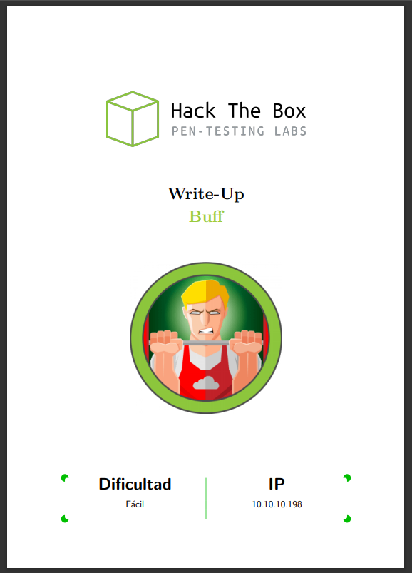
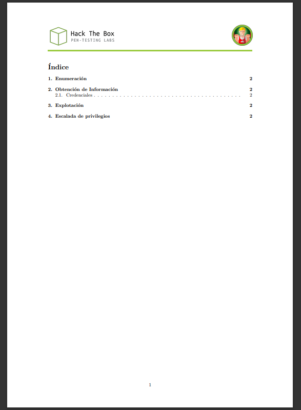
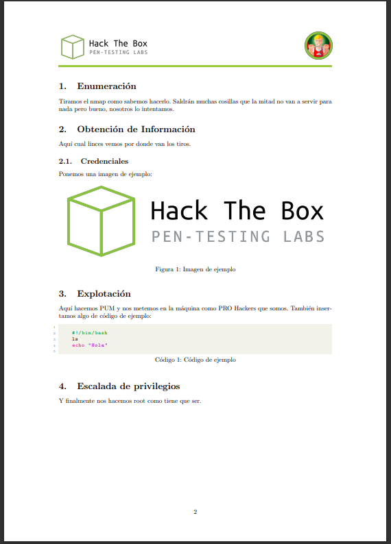

# Latex Template para Hack the Box
_Template para documentar de forma estructurada y visualmente agradable las máquinas de Hack the Box_


## 🔧 Uso
Para usarla simplemente descargamos o clonamos el repositorio en nuestro equipo: 
```
git clone https://github.com/rasp0wn/latex-HTB-template
```
Para editarlo hay que modificar el archivo **document.tex** con el editor que prefiramos (como VS Code, TeXstudio o cualquiera). En el archivo **document.pdf** se puede observar cómo es la plantilla aunque se incluyen capturas a continuación: 






